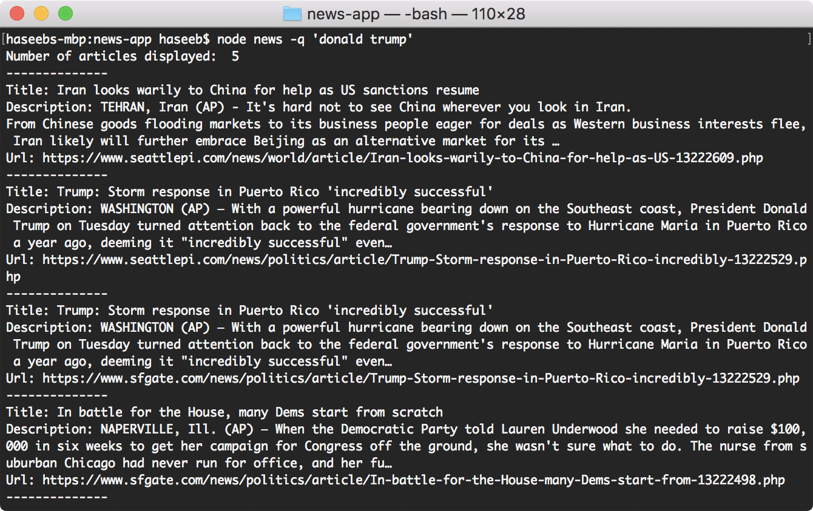
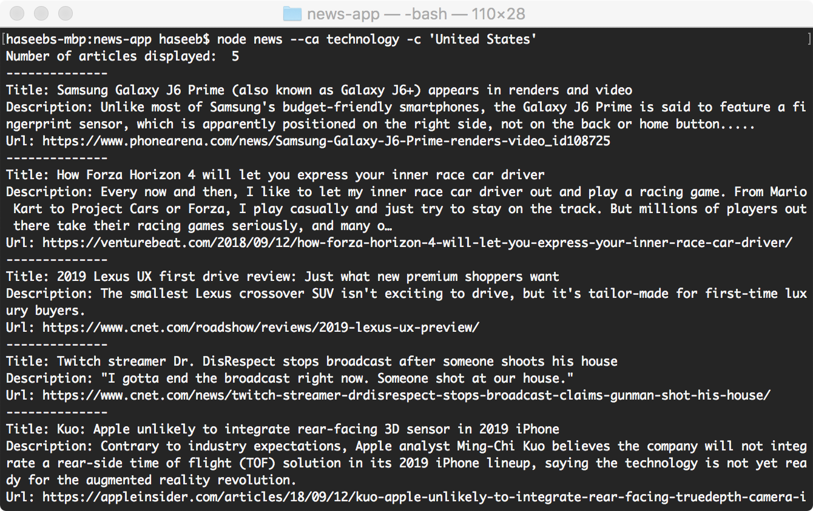
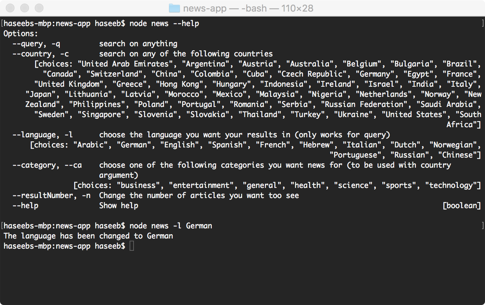

# Node-news

A command line application that gets the latest news using NodeJs.  
You can search for news on anything you like, news related to a specific country and news pertaining to a country on a chosen category.   News can be received in a language you have set (although only seems to properly work with queries) and you can change the number of results you want to display.   The results also give you the url to the article if you wish to do some further reading.

## Getting started

To get a copy of the files clone the repository

```
git clone https://github.com/haseebdaone/node-news.git
cd node-news/
npm install
```
or manually download the zip file above and run 'npm install' in the root of the downloaded folder (after being unzipped)

### Prerequisites

Make sure to have NodeJs installed https://nodejs.org/en/    
To use the app you must have an API key which you can get here for free https://newsapi.org/    
Once you have your API key paste it in the news.js file where it says

```
var apikey = 'insert api key here';
```

### How to use

Search for the latest news on anything you like (just make sure to use '' for searches that have more than one word) using the following command.
```
node news -q 'anything you like here'
```


Search on a certain category in a chosen country.
```
node news --ca 'category' -c 'country'
```


Shows available options and the choices within.     
(note that you can change the language you get results in but this only works properly for -q)
```
node news --help
```

